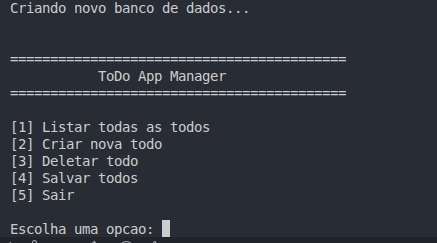

# Todo List

Se trata de uma simples aplicacao de linha de comando para gerenciar uma lista de tarefas (todos) escrita em Rust. Permite adicionar, listar, marcar como concluido e remover tarefas, bem como salvar e carregar a lista de tarefas de um arquivo JSON.

### Visao Geral



### Como Instalar

1. Tenha o Rust instalado. Voce pode instalar o Rust usando [rustup](https://rustup.rs/).


2. Clone este repositorio:
```bash
   git clone https://github.com/DanielDeAzevedoCordeiro1/Todo-List.git
```

3. Navegue ate o diretorio do projeto:
```bash   
   cd todo-rust
```

4. Compile o projeto (usando a opcao release para otimizar o binario):
```bash   
   cargo build --release
```

5. Execute o binario gerado:
```bash   
   ./target/release/todo-rust
```
